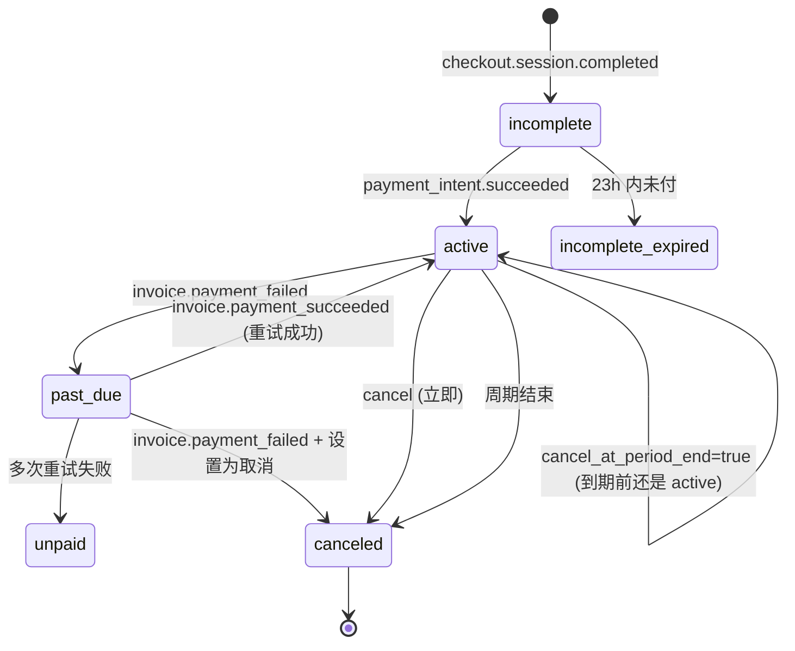

# Day 13 · 2026-05-20（周三）

> Week 2 · Auth + Payment
> 今天 2-2.5h · **阶段 2 精读日**

## 今天学什么

**主题**：把 Stripe 和 Clerk 从"跑通"沉淀为"能讲清"。

这是 Week 2 的**阶段 2 日**。前 5 天写了不少代码，但很多地方是"按 docs 抄"。今天把 docs 完整过一遍、画清楚状态机、列清楚边界条件 —— 把这两个技术封存到"会用会选"的层级，不再深入。

## 核心概念

今天要建立的 6 个稳固知识点：

1. **Stripe subscription 完整生命周期**：从 `incomplete` 到各种终态，每个 status 的触发条件和业务含义。
2. **Dunning 流程**：续费失败后的"智能重试" —— 卡过期、余额不足时 Stripe 自动重试 3-4 次，期间 status 在 `active ↔ past_due` 之间跳。
3. **Test clock**：Stripe 的"时间机器" —— 让你在测试里快进一个月触发续费，不用真等。
4. **Clerk 的 session 刷新机制**：publicMetadata 改动什么时候生效？默认 session token TTL 是多久？
5. **Organization 概念**（Clerk）：今天不实现，但知道"多人/团队账号"在 Clerk 里的抽象结构。
6. **Webhook 重试与幂等设计**：两家（Stripe / Clerk）的重试策略、时间间隔、放弃条件。

## 参考资源

今天主要在读，按这个顺序：

**Stripe（1h）**
- **[Subscription lifecycle](https://docs.stripe.com/billing/subscriptions/overview#subscription-lifecycle)** — 整页精读，每个 status 都要认识
- **[Webhooks best practices](https://docs.stripe.com/webhooks/best-practices)** — 重点看幂等、重试、顺序保证
- **[Test clocks](https://docs.stripe.com/billing/testing/test-clocks)** — 15 min，动手用一次
- **[Handling recurring billing issues](https://docs.stripe.com/billing/revenue-recovery)** — 理解 dunning

**Clerk（30 min）**
- **[Sessions](https://clerk.com/docs/authentication/configuration/session-options)** — 理解 session TTL
- **[Webhooks](https://clerk.com/docs/webhooks/overview)** — 和昨天的互补
- **[Organizations 概念](https://clerk.com/docs/organizations/overview)** — 扫一眼知道有这东西

## 动手练习

今天不写新功能，动手都是"验证 & 记录"：

### Part 1 · 画状态机（40 min）

在 `notes/stripe-subscription-state-machine.md` 里用 mermaid 或手画：

每条边标注**触发它的 Stripe event**。画完对照 Stripe docs 检查是否漏了。

### Part 2 · 动手玩 Test Clock（30 min）

1. 创建一个 test clock（frozen at now）
2. 创建一个 customer 挂到 clock 上
3. 给 customer 开一个 subscription
4. **前进时间 32 天** → 看是否触发 `invoice.paid` 续费 event
5. 把 customer 的卡换成 `4000000000000341`（会在后续 charge 失败的测试卡）
6. **再前进 30 天** → 看是否触发 `invoice.payment_failed` + `subscription.updated` (status → past_due)
7. 继续前进 → 看完整 dunning 流程

这是你第一次体验**时间尺度问题**的测试 —— production 里这种流程要等一个月才能观察，test clock 让你 5 分钟看完。

### Part 3 · 画 Clerk webhook 流（15 min）

在 `notes/clerk-cheatsheet.md` 记录：
- `user.created` / `user.updated` / `user.deleted` / `session.created` 分别什么时候触发
- Svix 重试策略（查文档）
- session token TTL 和"改 publicMetadata 什么时候生效"的关系

### Part 4 · 写 `notes/webhook-reliability.md`（15 min）

对比 Stripe 和 Clerk 的 webhook 特性：

| 维度 | Stripe | Clerk (Svix) |
|---|---|---|
| 重试次数 | ? | ? |
| 重试间隔 | ? | ? |
| 总重试时长 | ? | ? |
| 签名算法 | ? | ? |
| 顺序保证 | ? | ? |
| 幂等 key | `event.id` | `svix-id` |

查文档填表。**这张表以后每次对接新 webhook 系统都能复用**。

## 今天结束能回答

- 一个用户订阅时付款失败（卡被拒），5 分钟后用户重试成功 —— 你的 DB 订阅 status 应该经过哪些值？对应哪些 event？
- 一个用户的卡在续费时过期了，Stripe 会做什么？你的代码应该怎么响应？什么时候把用户标为 non-Pro？
- 如果你今天修了一个 webhook handler 的 bug 部署上去，过去 3 天里丢的 webhook 能追回来吗？（提示：Stripe dashboard 有 replay event 功能）

## 晚上 10 min

- `journal.md`：**今天最打动你的一个概念**（不用"aha/疑问/想挖"了，换一个更深的问题）
- commit `notes/stripe-subscription-state-machine.md` / `notes/clerk-cheatsheet.md` / `notes/webhook-reliability.md`
- 明天（Day 14）Week 2 收官 + 复盘
